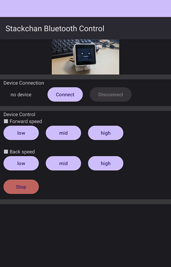
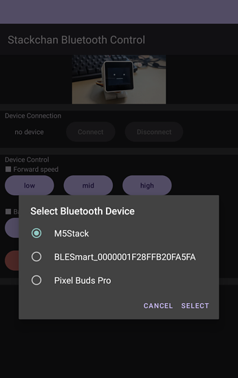
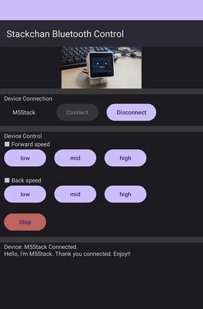

# stack-chan-tester-360-bluetooth-control-client-app

[BLEでM5Stackと通信](https://coskxlabsite.stars.ne.jp/html/android/BluetoothLE/bluetoothLE.html)で公開いただいているソースコードを元に、
[stack-chan-tester-360-bluetooth-control](https://github.com/u-tanick/stack-chan-tester-360-bluetooth-control)を制御するために作成したクライアントアプリ。

Android Studio Giraffe | 2022.3.1 Patch 3　で作成。

## 仕様

- Android 8.0(Oreo)以上を想定。
- M5StaskとBluetooth接続された状態で、アプリとのコネクションを行い、データの送受信を行う。]
- サーボモーターのスピードを前方／後方それぞれ3段階に設定可能。
- サーボモーターの停止も可能。
- 送信したデータなどの情報を画面下部にログとして表示。

## 画面

## ビルド手順

特に特殊な手順はないため、一般に公開されているサイトのリンクを紹介します。

[AndroidStudioでAPKファイルを作成する方法。Debug版とRelease版の作成【AndroidStudio】](https://nosystemnolife.com/androidapk/)

## 使い方（Bluetooth接続 (※)）

1. Androidスマホに、別途公開している、[Bluetooth接続用クライアントアプリ](https://github.com/u-tanick/stack-chan-tester-360-bluetooth-control-client-app) をインストール。
  - リポジトリにapkファイルも格納しています。
2. 本リポジトリのビルド結果をインストールしたM5Stackを起動。
3. M5StackとスマホをBluetoothで接続。
4. スマホアプリを起動し、[connect]ボタンを押し、アプリとの接続を確立。

5. アプリにある各種ボタンを操作して、サーボモーターを動作させる。

※ Bluetooth接続には、BLE(Bluetooth Low Energy)を利用しています。

## apk

デバッグ用のapkのサンプルを [apkフォルダの中]([../app/build/outputs/apk/debug](https://github.com/u-tanick/stack-chan-tester-360-bluetooth-control-client-app/tree/main/apk)) に格納しています。

### 免責事項

- 自作apkとなるため、「提供元不明のアプリ」のインストール許可が必要となります。
- ESETを入れたスマホでセキュリティチェック済みですが、インストールの際に発生する責任は負いかねます。ご了承ください。
